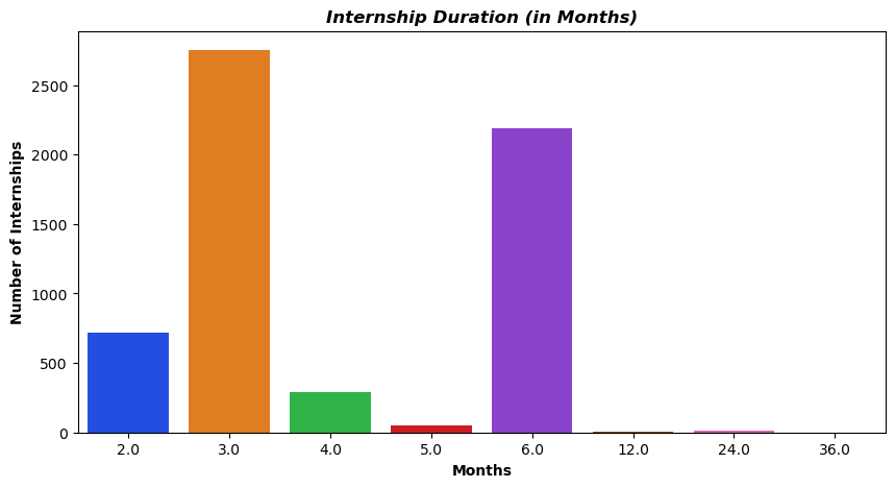
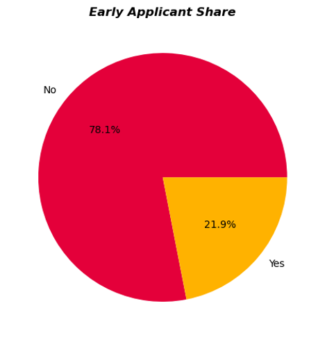

# 📊 Exploratory Data Analysis of Internships in India

##  Project Overview

This project performs an in-depth **Exploratory Data Analysis (EDA)** on internship listings scraped from [Internshala.com](https://internshala.com). With over **6,000 internship records**, this project helps students make data-informed decisions when choosing internships that align with their academic schedules and career goals.

##  Problem Statement

To analyze internship opportunities across:
- Locations
- Stipends
- Internship roles
- Full-time job offers (LPA)
- Early application behavior
- Hiring activity (actively hiring vs not)

## 🎯 Objectives

- Understand trends in internship duration, pay, and posting frequency  
- Examine the link between stipend and job offer potential  
- Identify top roles, locations, and companies offering high-value internships  
- Offer students insights for choosing better internships without hurting academics

## 🛠️ Tools & Technologies Used

- **Language**: Python (v3.12)
- **Libraries**:  
  - Data Collection: `BeautifulSoup`, `Requests`, `Time`, `Random`, `re`  
  - Data Analysis: `Pandas`, `NumPy`, `Datetime`  
  - Data Visualization: `Matplotlib`, `Seaborn`
- **Platform**: Jupyter Notebook

##  Dataset Summary

- **Source**: Internshala (Web scraped)
- **Size**: `6050 rows × 10 columns`
- **Key Columns**: `intern_role`, `company_name`, `hiring_type`, `location`, `stipend_per_month`, `duration`, `job_offer (LPA)`, `early_applicant`, `posted_time`

## 🧹 Data Cleaning Steps

- Converted `stipend` and `job_offer` from object to float  
- Cleaned `posted_time` to calculate exact posting dates  
- Handled missing values in `hiring_type`, `early_applicant`, and `duration` using **mode** or **median**  
- Removed `26` duplicate rows  
- Handled outliers using **IQR method**  
- Dropped unnecessary columns: `apply_links`, `posted_time`

## 📈 Key Insights (Visualized)

- **Top Roles**: Business Development, Digital Marketing dominate  
- **Top Locations**: Work-from-home > Mumbai > Bangalore > Delhi  
- **Most Common Duration**: 3–6 months  
- **Stipend Range**: ₹5,000–₹10,000 common; few above ₹15,000  
- **Job Offer Trends**: Most fall between 2–4 LPA; High offers are rare  
- **Hiring Behavior**: Over 52% are actively hiring; early application helps visibility but not guaranteed selection  
- **Location vs Pay**: Dubai has highest job offer avg (>9 LPA), followed by Pune, Mumbai
## Screenshots
## 📸 Screenshots
### 1️ Internship Duration (in Months)

This bar chart shows the distribution of internship durations.

- Most internships last 3 months, followed by 6 months.
- Very few internships extend beyond 12 months.

### 2️ Early Applicant Share

This pie chart highlights how many students applied early:

- 78.1% did not apply early.
- Only 21.9% were early applicants, showing limited proactive behavior.

### 3️ Distribution of Job Offer (LPA)

This histogram with density curve shows the spread of job offers (in LPA):

- Most offers fall in the 2–4 LPA range.
- Few outliers exist at higher salary packages (8–10 LPA).
  

### 4️ Location vs Internship Role (Heatmap)

This heatmap compares internship roles across different locations:

- Work-from-home internships dominate, especially in Business Development, Digital Marketing, and Graphic Design.
- Metro cities like Mumbai, Bangalore, and Delhi also have significant opportunities.

##  Want the full breakdown? My project PPT is up on GitHub:
[Check it out](https://github.com/Arul-DevX/EDA_of_internships_India/blob/main/EDA_project_presentation.pptx)

## Conclusions

- Work-from-home internships dominate and are ideal for students  
- High-paying internships and job offers are rare but tied to specific roles and cities  
- Early applicants may gain visibility, but not always a higher success rate  
- Business-focused and digital skill roles are in high demand

##  Author(s)

- Arul R  
- Saranya S

## 📅 Date

July 2025

## 📬 For Any Queries

Feel free to reach out via GitHub or email.

